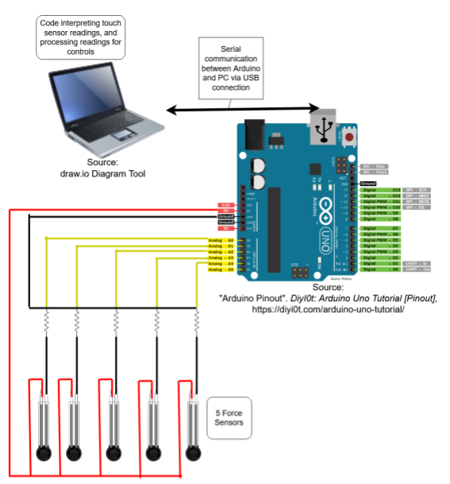

# ed2-handForceController
Engineering Design 1/2 Project for Group 9

TeamMembers:

Lillian Boettcher

Grant Kveton

Dhaval Manojkumar Shirvi


## HFController.cs documentation
*(as of 7/29/20, gkveton)*

#### Constructors:
HFController() - Initializes a new instance of the HFController class

#### Fields:
serialPort - System.IO.Ports.SerialPort object

serialMessage - incoming message form serial port

NUMBER_OF_SENSORS - number of sensors being read

readings - array containing sensor readings

#### Properties

IsConnected - Gets the boolean value of whether the serial port is open and connected for the device.

PortNames - Gets the array of string values for all available port names.

#### Methods:
GetSensorValue(int sensorId) - returns sensor reading from given sensor number. 

PrintReadings() - Debugging method used to print array of readings.

ClosePort() - Closes the connection to the serial port for the device.

##### Example use
```
using System.Collections;
using System.Collections.Generic;
using UnityEngine;

public class CubeController : MonoBehaviour
{
    private HFController controllerInput;   
    
    // Start is called before the first frame update
    void Start()
    {
        controllerInput = new HFController();
    }

    // Update is called once per frame
    void Update()
    {
        ProcessMovement();
        controllerInput.PrintReadings();
    }
    
    private void ProcessMovement()
    {
        if (controllerInput.GetSensorValue(0) > 800)
        {
            transform.position = transform.position + new Vector3(5f * Time.deltaTime, 0, 0);
        }
        if (controllerInput.GetSensorValue(1) > 800)
        {
            cube1.transform.position = cube1.transform.position - new Vector3(5f * Time.deltaTime, 0, 0);
        }
    }
    
    private void EndSimulation
    {
        //Application exit logic here, perhaps this function is called when an "Exit" button is clicked. 
        controllerInput.ClosePort();
    }
}
```

## Serial Communication Between Arduino and Unity C# 
*(as of 7/31/20, gkveton)*

If you do not have Unity installed, install it (The unity hub is a nice way to keep track of projects and install versions, in my opinion):
https://unity3d.com/get-unity/download

If you do not have the Arduino IDE installed, install it:
https://www.arduino.cc/en/main/software

Connect force sensors and Arduino based on circuit diagram:


Clone the project repository to your local machine:
https://github.com/grontis/ed2-handForceController

Open the "main" Arduino sketch in the Arduino IDE and upload the sketch to the Arduino:
File-> Open -> Navigate to the arduino/main folder in the cloned repo and open the Arduino file.
Make sure your Arduino is connected to USB of computer.
Sketch->Upload 
(You may need to check that your serial port for the Arduino is selected in the IDE correctly, this can be done under Tools->Port:… mine has an option for COM3(Arduino Uno))

Open the Unity project and run it to test communication:
Open the UnityHub, click “Add” and navigate to the cloned repo and select the “ed2-UnityProject” folder and click “select folder”. It is possible you may encounter that you do not have the project’s version of unity installed. If so you can click on “Installs” and install the version listed under the project (it will probably be best for us all to be working on the project in the same version since we are sharing the repository).
Open the project and in the project window in assets in the “Scenes” folder. Double click to open the “grant_3dobject_test”

This test scene involves moving 5 cubes based on 5 sensor values. Make sure that the value for NUM_OF_SENSORS is set to the correct number of sensors being used in both the HFController.cs script and the main arduino sketch.


press the play button (or CTRL+P) to start the application.
Once the scene is started in the Unity editor the script will programmatically attempt to connect to the Arduino and establish communication. This is done by sending a "wakeup" message to each of the available serial ports in the system. The main arduino sketch is programmed to await the "wakeup" message and will send a response when received. There is a mechanism of callbacks between the arduino and the software as data is transmitted. 


NOTE: When making a new Unity project (that isn’t the one setup in the repo) that will be using serial port communication, *before* creating your C# scripts you have to go into Edit-> Project Settings-> Player -> Api compatibility level and set it to “.NET 4.x”, and then restart Unity. Otherwise, the System.IO.Ports namespace will not import. From my debugging over this, I think it has something to do with the way Unity creates C# script assemblies. 
